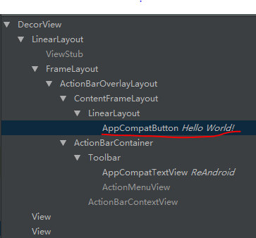
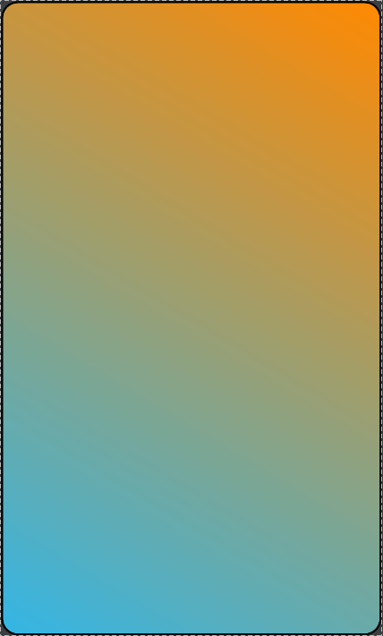

# Android中Button设置background过程研究

我们的目的是研究`Button`设置`android:background`的过程以及实现。

分两种情况。
第一种情况，`Button`所在的`Activity`继承于`AppCompatActivity`，这时使用`Android Studio`中的`Layout Inspector`工具解析屏幕中的控件，会发现`Button`被替换成了`AppCompatButton`。



第二种情况，`Button`所在的`Activity`继承于`Activity`，这种情况下，解析屏幕，`Button`没有被替换。

## Button

那么首先研究`Button`的源码，`Button`的源码很少，只是实现了4个构造方法和一个`getAccessibilityClassName`方法。

那么，能够产生`Button`与其父类(`TextView`)的差异是体现在第二个构造方法里
```java
public Button(Context context, AttributeSet attrs) {
    this(context, attrs, com.android.internal.R.attr.buttonStyle);
}
```
这里，将`defStyleAttr`（即默认的Style）设置为`com.android.internal.R.attr.buttonStyle`，所以正是因为这个属性，`Button`才与`TextView`显示得不一样。

## TextView

`Button`的构造方法最终是调用`TextView`的四个参数构造方法。
```java
public TextView(
            Context context, @Nullable AttributeSet attrs, int defStyleAttr, int defStyleRes){}
```

经过对这个构造方法里检索，并没有发现与`background`有关的代码，那么，真正的与`background`有关的代码一定在`TextView`的父类`View`里。

## View

在`View`中的四个参数构造方法中，找到了这样的代码：
```java
int attr = a.getIndex(i);
switch (attr) {
    case com.android.internal.R.styleable.View_background:
        background = a.getDrawable(attr);
        break;
    ...
}
```
追踪的过程按下不表，这里说一说最终的结果。

如果这个`drawable`是`ColorDrawable`的话，那么就会实例化一个`ColorDrawable`对象，否则，就会调用`loadDrawableForCookie`方法，即从`XML`中或者`resources stream`中加载`drawable`。

`loadDrawableForCookie`方法中的主要逻辑是这样的：
```java
if (file.endsWith(".xml")) {
    final XmlResourceParser rp = loadXmlResourceParser(
            file, id, value.assetCookie, "drawable");
    dr = Drawable.createFromXml(wrapper, rp, theme);
    rp.close();
} else {
    final InputStream is = mAssets.openNonAsset(
            value.assetCookie, file, AssetManager.ACCESS_STREAMING);
    dr = Drawable.createFromResourceStream(wrapper, value, is, file, null);
    is.close();
}
```

那么，接下来我们就了解一下`Drawable`中的静态方法`createFromResourceStream`和`createFromXml`方法。

### createFromResourceStream

这里就是先实例化一个`Bitmap`对象，然后判断这个`Bitmap`是否为`.9`图。如果是的话，则根据`Bitmap`生成一个`NinePatchDrawable`，否则，生成一个`BitmapDrawable`。

### createFromXml

这里最终是调用了`DrawableInflater.inflateFromXml`方法，这个方法返回一个`drawable`，但是其实返回的是它的子类。下面这段代码就是根据`XML`中的`TAG`进行判定这个`drawable`是属于什么类型的。
```java
private Drawable inflateFromTag(@NonNull String name) {
    switch (name) {
        case "selector":
            return new StateListDrawable();
        case "animated-selector":
            return new AnimatedStateListDrawable();
        case "level-list":
            return new LevelListDrawable();
        case "layer-list":
            return new LayerDrawable();
        case "transition":
            return new TransitionDrawable();
        case "ripple":
            return new RippleDrawable();
        case "color":
            return new ColorDrawable();
        case "shape":
            return new GradientDrawable();
        case "vector":
            return new VectorDrawable();
        case "animated-vector":
            return new AnimatedVectorDrawable();
        case "scale":
            return new ScaleDrawable();
        case "clip":
            return new ClipDrawable();
        case "rotate":
            return new RotateDrawable();
        case "animated-rotate":
            return new AnimatedRotateDrawable();
        case "animation-list":
            return new AnimationDrawable();
        case "inset":
            return new InsetDrawable();
        case "bitmap":
            return new BitmapDrawable();
        case "nine-patch":
            return new NinePatchDrawable();
        default:
            return null;
    }
}
```

到这里，终于见到了我们熟悉的东西了。我们这里就研究一下`shape`所对应的`GradientDrawable`。

### GradientDrawable

`Gradient`这个词我们就很熟悉了，它就是`shape`中的渐变属性嘛，如下面的代码：
```html
<?xml version="1.0" encoding="utf-8"?>
<shape xmlns:android="http://schemas.android.com/apk/res/android"
    android:shape="rectangle">
    <!-- 设置边框 -->
    <stroke
        android:width="2dp"
        android:color="@android:color/black" />
    <!-- 设置颜色渐变 -->
    <gradient
        android:angle="45"
        android:endColor="@android:color/holo_orange_dark"
        android:startColor="@android:color/holo_blue_light"
        android:type="linear" />
    <corners android:radius="@dimen/activity_horizontal_margin" />
</shape>
```
效果图如下，是一个从橘黄色到蓝色的渐变：



`GradientDrawable`中提供了一些和`xml`属性对应的方法：
* setCornerRadii - 设置边角半径
* setStroke - 设置边框（宽度+颜色）
* setSize
* setShape - RECTANGLE | OVAL | LINE | RING
* ...

在`GradientDrawable`中使用了一个`GradientState`内部类对象保存状态（即在`xml`里设置的那些属性）。

最后就是在`GradientDrawable`的`draw`方法中进行绘制。

好了，这就是你为`Button`设置一个`android:background`的大致过程。
