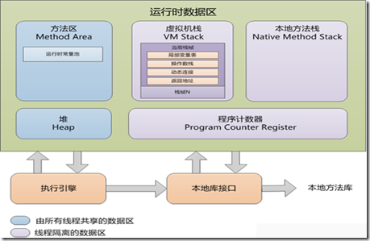

# Java 内存区域

## 运行时数据区域

Java 虚拟机在运行 Java 程序的过程中会把它所管理的内存划分为若干个不同的数据区域。这些区域各有各的用途，以及创建和销毁的时间，有的区域随着虚拟机进程的启动而存在，有些区域则依赖用户线程的启动和结束而建立和销毁。

### 程序计数器

线程私有。

程序计数器是一块比较小的内存空间，它可以看作是当前线程所执行的字节码的行号指示器。

如果线程执行的一个 Java 方法，这个计数器记录的是正在执行的虚拟机字节码指令的地址，如果正在执行的是 Native 方法，则这个计数器值为空。

### Java 虚拟机栈

线程私有，生命周期与线程相同。

描述的是 Java 方法执行的内存模型

方法 <--> 栈帧（StackFrame）

栈帧中存储局部变量表、操作数栈、动态链接、方法出口的信息等等。

### Java 堆

线程共享、虚拟机启动的时候创建，存放对象实例   GC 堆

### 方法区

线程共享、存储已经被虚拟机加载的类信息、常量、静态变量、即时编译器编译的代码等数据。

被称为永久代，内存回收目标主要是针对常量池的回收和对类型的卸载

### 运行时常量池

方法区的一部分
