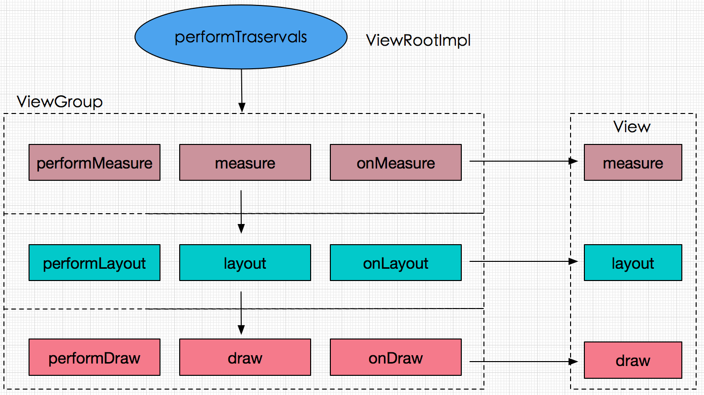
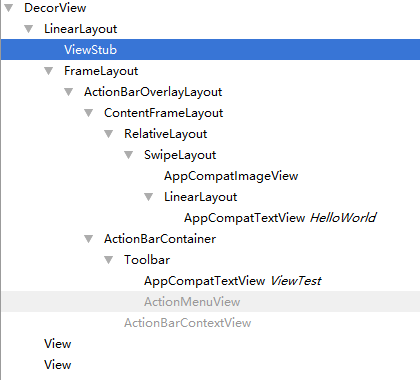

# View 的工作原理

## ViewRoot 和 DecorView

ViewRoot 对应于 ViewRootImpl 类，它是连接 WindowManager 和 DecorView 的纽带，View 的三大流程均是通过 ViewRoot 来完成的。在 ActivityThread 中，当 Activity 对象被创建完毕后，会将 DecorView 添加到 Window 中，同时创建 ViewRootImpl 对象，并将 ViewRootImpl 对象和 DecorView 建立关联。

View 的绘制是从 ViewRoot 的 `performTraversals()` 方法开始的，它经过 **measure、layout 和 draw** 三个过程才能最终将一个 View 绘制出来。其中，measure 用来测量 View 的宽和高，layout 用来确定 View 在父容器中的放置位置，而 draw 则负责将 View 绘制在屏幕上。



performTraversals 会依次调用 `performTraversals()`、`performLayout()`、`performDraw()` 三个方法，这三个方法分别完成顶级 View 的 measure、layout 和 draw 这三大流程。在 `onMeasure()` 方法中会对所有的子元素进行 measure 过程，这个时候 measure 流程就从父容器传递到子元素中了，接着子元素会重复父容器的 measure 过程，这样就完成了整个 View 树的遍历。同理，performLayout 和 performDraw的传递流程和 performMeasure 是类似的，只是 performDraw 的传递过程是在 draw 方法中 通过dispatchDraw 来实现的。

Measure 过程决定了 View 宽和高，measure 完成之后，可以通过 `getMeasuredWidth()` 和 `getMesuredHeight()` 获取 View 测量后的宽和高，几乎所有情况它都等于 View 最终的宽和高。

Layout 过程决定了 View 的四个顶点的坐标和实际的 View 的宽和高，完成之后可以通过 `getTop()`、`getBottom()`、`getLeft()` 和 `getRight()` 获取 View 的四个顶点的位置。

Draw 过程则决定了 View 的显示，只有 draw 完成以后，View 的内容才能呈现在屏幕上。



如图所示，DecorView 作为顶级 View，一般情况下它内部会包含一个竖直方向的 LinearLayout，在这个 LinearLayout 里面一般分为两部分，上面是 标题栏，下面是内容栏。在 Activity 通过 setContentView 所设置的布局文件其实就是被加到内容栏之中，而内容栏的 id 是 content。

可以通过 `ViewGroup content = (ViewGroup)findViewById(android.R.id.content);`来获取 contentView。

DecorView 是一个 FrameLayout。

## MeasureSpec

在测量过程中，系统会将 View 的 LayoutParams 根据父容器所施加的规则转换为对应的 measureSpec，然后再根据这个 measureSpec 来测量 View 的宽和高。

MeasureSpec 代表一个 32 位 int 值，高 2 位代表 SpecMode，低 30 位代表 SpecSize，SpecMode 代表测量模式，而 SpecSize 是指再某种测量模式下的规格大小。

SpecMode 有三类，每一类都表示特殊的含义：

* UNSPECIFIED，父容器不对 View 有任何限制，要多大给多大，这种情况一般用于系统内部，表示一种测量的状态。

* EXACTLY，父容器已经检测出 View 所需要的精度大小，这个时候 View 的最终大小就是 SpecSize 所指定的值。它对应于 LayoutParams 中的 match_parent 和具体的数值这两种模式。

* AT_MOST，父容器指定了一个可用大小即 SpecSize，View 的大小不能大于这个值，具体是什么值要看不同 View 的具体实现。它对应于 LayoutParams 中的 wrap_content。

### MeasureSpec 和 LayoutParams 的对应关系

在 View 测量的时候，系统会将 LayoutParams 在父容器的约束下转换为对应的 MeasureSpec，然后再根据这个 MeasureSpec 来确定 View 测量后的宽和高。需要注意的是，**MeasureSpec 不是唯一由 LayoutParams 决定的，LayoutParams 需要和父容器一起才能决定 View 的 MeasureSpec，从而进一步决定了 View 的宽和高。**

对于 DecorView 和普通 View 来说，MeasureSpec 的转换过程略有不同。对于 DecorView，其 MeasureSpec 由窗口的尺寸和其自身的 LayoutParams 来共同确定。

DecorView 的 MeasureSpec 的产生过程遵守如下规则，根据它的 LayoutParams 中的宽和高的参数进行划分：

* LayoutParams.MATCH_PARENT，精确模式，大小就是窗口的大小。

* LayoutParams.WRAP_CONTENT，最大模式，大小不定，但是不能超过窗口的大小。

* 固定大小（比如 100dp），精确模式，大小为 LayoutParams 中指定的大小。

子元素 MeasureSpec 的创建与父容器的 MeasureSpec 和子元素本身的 LayoutParams 有关，此外还和 View 的 margin（子元素） 和 padding（父容器） 有关。


当 View 采用固定宽和高的时候，不管父容器的 MeasureSpec 是什么，View 的 MeasureSpec 都是精确模式并且大小遵循 LayoutParams 中的大小。

## View 的工作流程

View 的工作流程主要是指 measure、layout、draw 这三大流程。

### measure

由 `measure()` 方法完成，measure 方法是一个 final 类型的方法，在 View 的 measure 方法中会去调用 View 的 `onMeasure()` 方法。

直接继承 View 的自定义控件需要重写 `onMeasure()` 方法并设置 wrap_content 时的自身大小，否则在布局中使用wrap_content 就相当于使用 match_parent。

*支持 wrap_content*
```java
private int mDefaultWidth = 400;
private int mDefaultHeight = 400;

@Override
protected void onMeasure(int widthMeasureSpec, int heightMeasureSpec) {
    super.onMeasure(widthMeasureSpec, heightMeasureSpec);
    int widthSpecMode = MeasureSpec.getMode(widthMeasureSpec);
    int widthSpecSize = MeasureSpec.getSize(widthMeasureSpec);
    int heightSpecMode = MeasureSpec.getMode(heightMeasureSpec);
    int heightSpecSize = MeasureSpec.getSize(heightMeasureSpec);
    if (widthSpecMode == MeasureSpec.AT_MOST && heightSpecMode == MeasureSpec.AT_MOST) {
        setMeasuredDimension(mDefaultWidth, mDefaultHeight);
    } else if (widthSpecMode == MeasureSpec.AT_MOST) {
        setMeasuredDimension(mDefaultWidth, heightSpecSize);
    } else if (heightSpecMode == MeasureSpec.AT_MOST) {
        setMeasuredDimension(widthSpecSize, mDefaultHeight);
    }
}
```

对于 ViewGroup 来说，除了完成自己的 measure 过程以外，还会遍历去调用所有子元素的 `measure()` 方法，各个子元素再递归去执行这个过程。

系统可能会执行多次 `measure()` 才能确定最终的测量宽和高。所以，**在 `onLayout()` 方法中去获取 View 的测量宽高或者最终宽高**。

### layout
