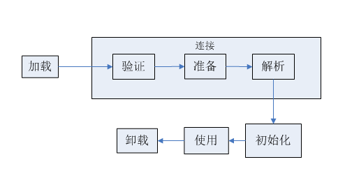

# 第七章——虚拟机类加载机制

虚拟机把描述类的数据从 Class 文件加载到内存，并对数据进行校验、转换解析和初始化，最终形成可以被虚拟机直接使用的 Java 类型，这就是虚拟机类加载机制。

在 Java 语言里面，类的加载、连接和初始化过程都是在程序运行期间完成的。

## 类加载的时机

类从被加载到虚拟机内存中开始，到卸载出内存为止，它的整个生命周期包括：加载、验证、准备、解析、初始化、使用和卸载 7 个阶段。其中验证、准备、解析 3 个部分统称为连接。

加载、验证、准备、初始化和卸载这 5 个阶段的顺序是确定的，类的加载过程必须按照这种顺序按部就班地开始，而解析阶段则不一定：它在某些情况下可以在初始化阶段之后再开始，这是为了支持 Java 语言地运行时绑定（也称为动态绑定或晚期绑定）

虚拟机规范严格规定了有且只有 5 种情况必须立即对类进行“初始化”（而加载、验证、准备自然需要在此之前开始）：

1. 遇到 new、getstatic、putstatic 或 invokestatic 这4条字节码指令时，如果类没有进行过初始化，则需要先触发其初始化。生成这 4 条指令最常见的场景是：使用 new 关键字实例化对象的时候、读取或设置一个类的静态变量（被 final 修饰、已在编译期把结果放入常量池的静态字段除外）的时候，以及调用一个类的静态方法的时候。

2. 使用 java.lang.reflect 包的方法对类进行反射调用的时候，如果类没有进行过初始化，则需要先触发其初始化

3. 当初始化一个类的时候，如果发现其父类还没有进行过初始化，则需要先触发其父类的初始化。

4. 当虚拟机启动时，用户需要指定一个要执行的主类（包含 main() 方法的那个类），虚拟机会先初始化这个主类。

5. 当使用 JDK 1.7 的动态语言支持时，如果一个 java.lang.invoke.MethodHandle 实例最后的解析结果 REF_getState、REF_putState、REF_invokeStatic 的方法的句柄，并且这个方法句柄所对应的类没有进行过初始化，则需要先触发其初始化。

上述这五种场景的行为称为对一个类进行主动引用。除此之外，所有引用类的方式都不会触发其初始化，称为被动引用。

被动引用例子：

1. 通过子类引用父类的静态字段，不会导致子类初始化。

  对于静态字段，只有直接定义这个字段的类才会被初始，因此通过其子类引用父类中的静态字段，只会触发父类的初始化而不会触发子类的初始化。

2. 通过数组定义引用类，不会触发此类的初始化

3. 常量在编译阶段会存入调用类的常量池中，本质上并没有直接引用到定义常量的类，因此不会触发定义常量的类的初始化。

接口也有初始化过程，编译器仍然会为接口生成 “<clinit>()” 类构造器，用于初始化接口中所定义的成员变量。接口与类真正有所区别的是前面讲述的 5 种“有且仅有”需要开始初始化中的第 3 种：当一个类在初始化时，要求其父类全部都已经初始化了，但是一个接口在初始化时，并不要求其父接口全部都完成了初始化，只有在其真正使用到父接口的时候（如引用接口中定义的常量）才会初始化。

## 类加载的过程

### 加载

在加载阶段，虚拟机需要完成以下 3 件事情：

1. 通过一个类的全限定名来获取定义此类的二进制字节流

2. 将这个字节流所代表的静态存储结构转换为方法区的运行时数据结构

3. 在内存中生成一个代表这个类的 java.lang.Class 对象，作为方法区这个类的各种数据结构的访问入口。

加载阶段完成后，虚拟机外部的二进制字节流就按照虚拟机所需的格式存储在方法区之中，方法区中的数据存储格式由虚拟机实现自行定义。

加载阶段与连接阶段的部分内容（如一部分字节码文件格式验证动作）是交叉进行的，加载阶段可能未完成，连接阶段可能已经开始，但这些夹在加载阶段之中进行的动作，仍然属于连接阶段的内容，这两个阶段的开始时间仍然保持着固定的先后顺序。

### 验证

为了确保 Class 文件的字节流包含的信息符合当前虚拟机的要求，并且不会危害虚拟机自身的安全。

1. 文件格式验证，检验字节流是否符合 Class 文件格式的规范，并且能被当前版本的虚拟机处理。
  * 是否以魔数 0xCOFEBABE 开头
  * 主次版本是否在当前虚拟机处理范围之内
  * 常量池的常量中是否有不被支持的常量类型（检查常量 tag 标志）
  * 指向常量的各种索引值中是否有指向不存在的常量或不符合类型的常量
  * CONSTANT_Utf8_info 型的常量中是否有不符合 UTF8 编码的数据
  * Class 文件中各个部分及文件本身是否有被删除的或附加的其他信息
  * ...
2. 元数据验证，对字节码描述的信息进行语义分析，以保证其描述的信息符合 Java 语言规范的要求。
  * 是否有父类
  * 是否继承了不允许被继承的类
  * 是否实现了父类或者接口之中要求实现的所有方法
  * 类中的字段、方法是否与父类产生矛盾（例如覆盖了父类的 final 字段，或者出现不符合规则的方法重载，例如方法参数都一致，但返回值类型却不同等）
  * ...
3. 字节码验证，通过数据流和控制流分析，确定程序语义是合法的、符合逻辑的，保证被校验类的方法在运行时不会做出危害虚拟机安全的事件。
  * 保证任意时刻操作数栈的数据类型与指令代码序列能够配合工作，例如不会出现类似这样的情况：在操作数栈放置一个 int 类型的数据，使用时却按 long 类型来加载入本地变量表
  * 保证跳转指令不会跳转到方法体以外的字节码指令上
  * 保证方法体中的类型转换是有效的，例如可以把子类对象赋值给父类数据结构，是安全的，但是反过来是危险的、不合法的
  * ...
4. 符号引用验证，在解析阶段中发生，可以看做对类自身以外（常量池中的各种符号引用）的信息进行匹配性校验
  * 通过字符串描述的全限定名是否能够找到对应的类
  * 在指定类中是否存在符合方法的字段描述以及简单名称所描述的方法和字段
  * 符号引用中的类、字段、方法的访问性（private 、protected、public、default）是否可被当前类引用。
  * ...

### 准备

**准备阶段是正式为类变量分配内存并设置类变量初始值的阶段**，这些变量所使用的内存都将在**方法区**中进行分配。这时候进行内存分配的仅包括类变量（被 static 修饰的变量），而不包括实例变量，实例变量将会在对象实例化随着对象一起分配在 Java 堆中。其次，这里所说的初始值“通常情况下”是数据类型的零值。

特殊情况：如果类字段的字段属性表中存在 ConstantValue 属性，那么在准备阶段变量 value 就会被初始化为 ConstantValue 属性所指定的值。

### 解析

**解析阶段是虚拟机将常量池内的符号引用替换为直接引用的过程**。

* 符号引用：符号引用以一组符号来描述所引用的目标，符号可以是任何形式的字面量，只要使用时能无歧义地定位到目标即可。符号引用与虚拟机实现地内存布局无关，引用的目标并不一定已经加载到内存中。各种虚拟机实现的内存布局可以各不相同，但是它们能接受的符号引用必须都是一致的，因为符号引用的字面量形式明确定义在 Java 虚拟机规范的 Class 文件格式中。

* 直接引用：直接引用可以是直接指向目标的指针、相对偏移量或是以个能直接定位到目标的句柄。直接引用和虚拟机实现的内存布局是相关的，同一个符号引用在不同虚拟机实例上翻译出来的直接引用一般不会相同。如果有了直接引用，那引用的目标必定已经在内存中存在。

对同一个符号引用进行多次解析请求是很常见的事情，除 invokedynameic 指令以外，虚拟机实现可以对第一次解析的结果进行缓存（在运行时常量池中记录直接引用，并把常量标记为已解析状态）从而避免解析动作重复进行。

解析动作主要针对类或接口、字段、类方法、接口方法、方法类型、方法句柄和调用点限定符 7 类符号引用进行。

### 初始化

初始化阶段是类加载过程的最后一步，前面的类加载过程中，除了在加载阶段用户应用程序可以通过自定义类加载器参与以外，其余动作完全由虚拟机主导和控制。到了初始化阶段，才真正开始执行类中定义的 Java 代码（或者说是字节码）。

在准备阶段，变量已经赋过一次系统要求的初始值，而在初始化阶段，则根据程序员通过程序制定的主观计划去初始化变量和其他资源，或者可以从另外一个角度：初始化阶段是执行类构造器 <clinit>() 方法的过程。

<clinit>() 方法是由编译器自动收集类中的所有类变量的赋值动作和静态语句块（static{}）中的语句合并而成的，编译器收集的顺序是由语句在源文件中出现的顺序所决定的，静态语句块中只能访问到定义在静态语句块之前的变量，定义在它后面的变量，在前面的静态语句块可以赋值，但是不能访问。

<clinit>() 方法与类的构造函数不同，它不需要显式地调用父类构造器，虚拟机会保证在子类的 <clinit>() 方法执行之前，父类的 <clinit>() 方法已经执行完毕。因此在虚拟机中第一个执行 <clinit>() 方法的类肯定是 java.lang.Object。

由于父类的 <clinit>() 方法先执行，也就意味着**父类中定义的静态语句块要优先于子类的变量赋值操作**。

<clinit>() 方法对于类或接口来说不是必需的，如果一个类中没有静态语句块，也没有对变量的赋值操作，那么编译器可以不为这个类生成 <clinit>() 方法

接口中不能使用静态语句块，但仍然有变量初始化的赋值操作，因此接口与类一样都会生成 <clinit>() 方法。但接口与类不同的是，执行接口的 <clinit>() 方法不需要先执行父接口的 <clinit>() 方法。只有父接口中定义的变量使用时，父接口才会初始化。另外，接口的实现类在初始化时也一样不会执行接口的 <clinit>() 方法。

虚拟机会保证一个类的 <clinit>() 方法在多线程环境中会被正确地加锁、同步。

## 类加载器
